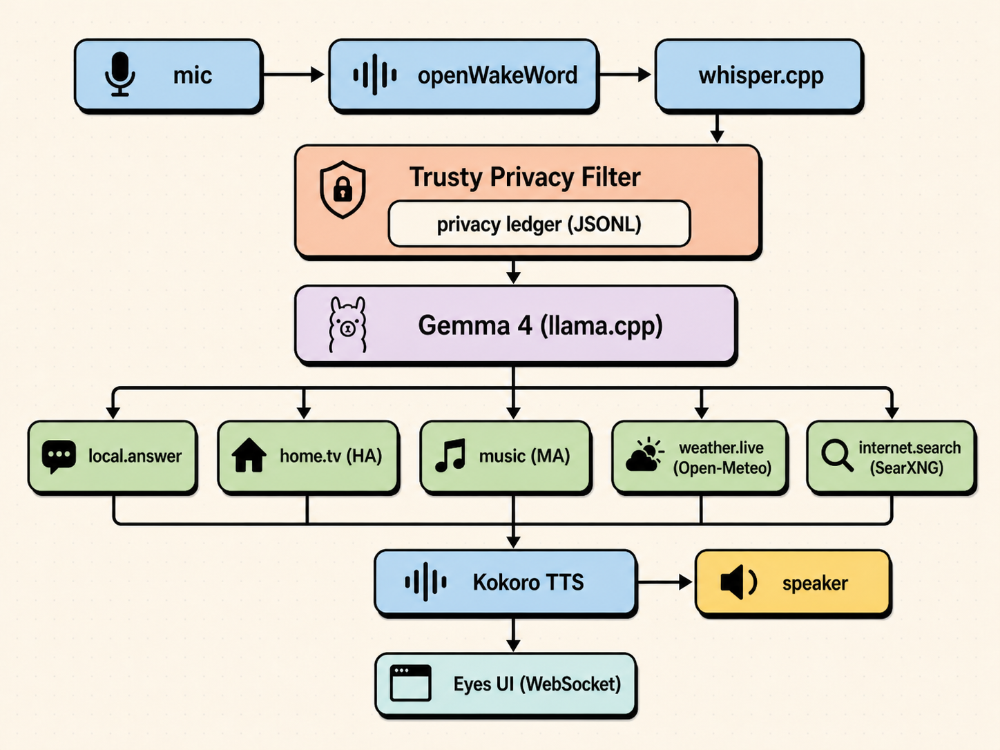
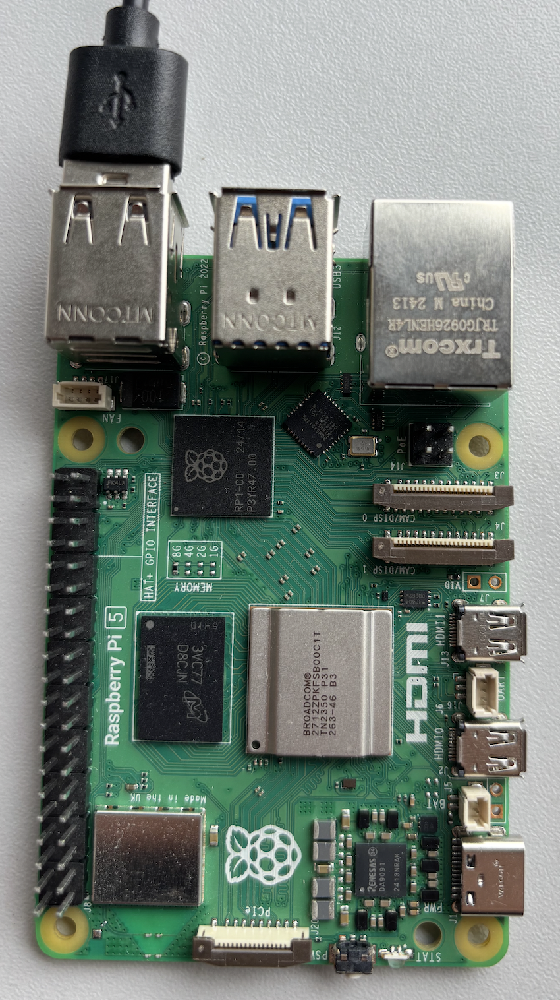

# Trusty (Gemma)

### Privacy-first local voice assistant for Mac & Raspberry Pi 5.

> Wake phrase: **"Hey Trusty"**.

Microphone audio never leaves the device. Only approved text tool requests may, and every turn is recorded in a local privacy ledger.

## Why Trusty ?
Most offline assistants (Rhasspy, OpenVoiceOS, Home Assistant Assist) match voice against trained intent templates, so only pre-trained phrasings work. **Trusty uses Gemma 4 itself as the orchestrator**, picking tools and arguments by reasoning. The LLM is the brain of the home, not just the chat layer.


## Features

- **Local Gemma 4 (brain and orchestration)** (E2B IT GGUF, Q6_K by default) running on `llama.cpp` switch via `GEMMA_QUANT` in `.env` (Q8_0 / Q6_K / Q5_K_M)
- **Local STT** via Moonshine ONNX (default, ~3× faster than whisper.cpp) or whisper.cpp switch via `STT_BACKEND` in `.env`
- **Local TTS** via Kokoro ONNX (natural voice, ~80 MB int8 model)
- **Local wake word** via openWakeWord
- **LG webOS TV control** through Home Assistant
- **Music** via Music Assistant + a local folder
- **Live weather** via Open-Meteo (location text only leaves the device)
- **Web search** via SearXNG (query text only leaves the device)
- **Eyes UI** animated eyes on a screen, served locally over WebSocket
- **Admin panel** runtime mode toggle, pause switch, service health, ledger
- **Local memory** voice commands like *"update my location to Dublin"* or *"my name is Ahmad"* route to a `memory` tool that writes to `data/memory.json`. Cleared with *"forget my memory"*. Never leaves the device.

## Architecture

The application is built to guarantee that no audio, voice data, or recordings ever leave the device. When Gemma decides to use an online tool (weather, web search), only the minimum necessary text is sent. Most interactions can also run fully locally in offline mode using admin screen.



We used Antigravity and Gemini for development.

## Quick start (Mac dev)

```bash
python3 -m venv .venv
.venv/bin/pip install -r requirements.txt

bash scripts/download_models.sh   # ~5 GB total
docker compose up -d              # HA + Music Assistant + SearXNG

bash scripts/run_llama_server.sh  # terminal A
bash scripts/run_trusty.sh        # terminal B
bash scripts/run_voice.sh         # terminal C needs mic permission

bash scripts/smoke_test.sh        # verify
```

Open <http://localhost:8090/eyes/> for the eyes, <http://localhost:8090/admin/> for the admin panel.

Full command flow → [`RUNBOOK.md`](RUNBOOK.md).
Pi deployment + custom wake-word training → [`NEXT_STEPS.md`](NEXT_STEPS.md).

## Pi easy start

After the Pi is provisioned (see [`NEXT_STEPS.md`](NEXT_STEPS.md) for the
one-time setup), every reboot needs **one command** from your laptop:

```bash
ssh <user>@<pi-host> 'bash ~/trusty/boot.sh'
```

Reattach to watch logs / interact:

```bash
tmux attach -t trusty   # detach with Ctrl-b d
```

Stop everything:

```bash
tmux kill-session -t trusty
```

## Demo prompts

```
Hey Trusty, what is the capital of Jordan?     → local
Hey Trusty, will it rain in Dublin today?      → weather (location only)
Hey Trusty, search the latest Raspberry Pi news      → search (text only)
Hey Trusty, open YouTube on the TV              → LG via HA
Hey Trusty, play music from my offline folder   → local files
Hey Trusty, send my microphone audio online    → blocked
```

## Privacy promise

| Tool             | Internet | Allowed payload    | Audio leaves? |
|------------------|----------|--------------------|---------------|
| local.answer     | no       | none               | no            |
| home.tv          | no (LAN) | none               | no            |
| music            | no       | none               | no            |
| weather.live     | yes      | location text only | no            |
| internet.search  | yes      | query text only    | no            |

Every turn writes one line to `data/privacy_ledger.jsonl`.
Audio uploads are hard-locked off in `app/main.py` the admin endpoint
returns HTTP 403 if anything tries to flip them on.

## Project layout

```
app/        FastAPI orchestrator, planner, validator, ledger
voice/      wake / STT / TTS / mic loop
tools/      per-tool adapters (HA, weather, search, music, ...)
prompts/    Gemma planner + final-answer prompts
config/     tools.yaml, privacy_policy.yaml, offline_mode.yaml
ui/eyes/    Eyes UI (HTML / CSS / canvas)
ui/admin/   Admin panel (HTML / CSS / JS)
scripts/    download_models, run_*, setup_pi, smoke_test
systemd/    Pi service units
docker-compose.yml   HA + Music Assistant + SearXNG
```

## Hardware



Trusty is built for the **Raspberry Pi**, but the same stack
also runs on **macOS** (Apple Silicon and Intel) for development and
day-to-day use.

- Raspberry Pi 5 (**8 GB RAM**)
- USB or 3.5 mm speaker
- USB microphone
- Optional: HDMI display, LG webOS TV on the same LAN, Roborock vacuum

You can run Trusty on a Raspberry Pi (**4 GB RAM**) by offloading Home Assistant and Music Assistant to other devices on your local network, keeping the Pi dedicated to Gemma (via llama.cpp), speech recognition, and audio. The Pi can still reach home and music services using the IP addresses.

Also runs on macOS (Apple Silicon / Intel) see *Quick start (Mac dev)* above

## Documentation

- [`RUNBOOK.md`](RUNBOOK.md)  commands only, Mac + Pi
- [`TV_SETUP.md`](TV_SETUP.md)  pair the LG webOS TV with Home Assistant
- [`WAKE_WORD.md`](WAKE_WORD.md)  change the wake word, including custom training
- [`NEXT_STEPS.md`](NEXT_STEPS.md)  testing, Pi deploy, files-to-delete
- [`blueprint.md`](blueprint.md)  full design rationale and competition notes

## Memory tips for low-RAM devices

If you hit memory pressure on Pi 8 GB, these changes save ~650 MB with zero quality impact:

| Change | RAM saved | Risk |
|---|---|---|
| `--ctx-size 1024` in `scripts/run_llama_server.sh` | ~400 MB | none |
| `--parallel 1 --n-predict 256` in `scripts/run_llama_server.sh` | ~150 MB | none |
| Skip SearXNG container in `docker-compose.yml` | ~100 MB | none if you don't use search |

### Gemma quantization (`GEMMA_QUANT`)

Pick the GGUF quant that fits your hardware. Set `GEMMA_QUANT` in `.env`
before running `bash scripts/download_models.sh` and the script fetches
the matching file. Update `GEMMA_MODEL_PATH` to the matching `*-q*.gguf`.

| Quant | Size on disk | Quality | When to use |
|---|---|---|---|
| `Q8_0` | ~5.0 GB | reference | Mac dev, plenty of RAM |
| `Q6_K` (default) | ~3.7 GB | near-identical | Pi 5 / production (best balance) |
| `Q5_K_M` | ~3.2 GB | slight drop | very tight RAM |

**Pair Whisper to match.** Smaller Gemma → smaller Whisper, otherwise STT
becomes the bottleneck on Pi:

| `GEMMA_QUANT` | Recommended `WHISPER_MODEL_PATH` | STT latency on Pi 5 |
|---|---|---|
| `Q8_0` | `ggml-small.en.bin` | ~6–8 s |
| `Q6_K` / `Q5_K_M` | `ggml-base.en.bin` | ~2–3 s |

`base.en` is slightly less accent-tolerant but ~3× faster on CPU. The Pi
preset (Q6_K + base.en) is the right default for production voice use.

## Speech to text (`STT_BACKEND`)

Two interchangeable backends, both fully on-device. Switch via
`STT_BACKEND` in `.env`. The dispatcher in [`voice/stt.py`](voice/stt.py)
routes to the chosen backend with no fallback.

| Backend | Size | Pi 5 latency (5 s clip) | Accent handling | Notes |
|---|---|---|---|---|
| **`moonshine`** (default) | ~120 MB | **~0.9 s** | strong | Useful Sensors' edge STT, ONNX, runs offline from `models/moonshine/<size>/` |
| `whisper` | 142 MB – 1.4 GB | 2–8 s depending on model | strong (small.en) | classic `whisper.cpp` via subprocess, paired with the Gemma quant |

Moonshine is the right default for a fluent voice assistant on Pi 5.
Whisper is kept as the alternative for cases that need its richer
multilingual coverage or where you've already validated a specific
Whisper variant for your accent.

**Privacy:** both backends run with the model files held inside the
project (`models/moonshine/...` or `models/whisper/...`). No outbound
calls at runtime. Moonshine's loader passes an explicit `models_dir` to
ONNX Runtime so the Hugging Face Hub code path is never touched after
the initial download.

To switch:

```bash
# .env
STT_BACKEND=moonshine    # or whisper
MOONSHINE_MODEL=base     # tiny | base
```

Restart only the voice loop (`pkill -f voice.loop && bash scripts/run_voice.sh`).

## License

MIT.
