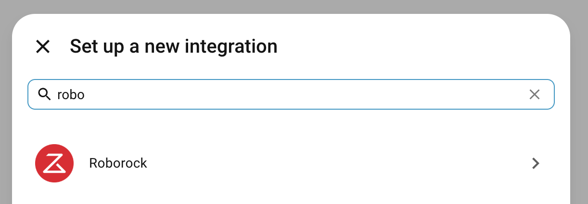

# Vacuum setup: Home Assistant + Roborock integration

This is the one-time setup that makes vacuum voice commands actually do
something. After this, *"Hey Trusty, stop the vacuum"* and *"Hey Trusty,
send the robot home"* work end-to-end.

Trusty itself never talks to the vacuum directly, it asks Home
Assistant, and HA pairs with the Roborock cloud over your account. Only
the vacuum status lookups leave your network (to Roborock's cloud); no
microphone audio ever does.

We tested this with a **Roborock S6 Pure**, but the same flow works for
any Roborock model that the Home Assistant Roborock integration supports
(S4 / S5 / S6 / S7 / S8 / Q-series / Qrevo).

---

## What you need

| Item | Notes |
|---|---|
| Roborock vacuum on the same Wi-Fi as Home Assistant | Set up once via the official Roborock app |
| Roborock account email + password | The same account you used in the Roborock app |
| Access to that email inbox | Roborock sends a verification code |
| HA running | `docker compose ps` should show `trusty-homeassistant Up` |

---

## Step-by-step

### Step 1: Open Home Assistant

| Where Trusty runs | URL |
|---|---|
| Mac dev box | [http://localhost:8123](http://localhost:8123) |
| Raspberry Pi | [http://raspberrypi.local:8123](http://raspberrypi.local:8123) |

If this is your first time opening HA, complete the onboarding wizard
(create the admin account, pick country/timezone). You'll land on the
HA dashboard.

### Step 2: Add the Roborock integration

1. Bottom-left → **Settings**
2. **Devices & Services**
3. Top right → **Add Integration**
4. Search for **"Roborock"** and click it



### Step 3: Enter your Roborock account email

A dialog asks for the email you use with the Roborock app. Type it in
and click **Submit**.

Roborock sends a 6-digit verification code to that email within a few
seconds.

### Step 4: Paste the verification code into HA

1. Open your email inbox, find the message from Roborock
2. Copy the 6-digit code
3. Paste it into the HA dialog and click **Submit**

HA discovers every Roborock device on your account automatically. For
each vacuum it finds, it creates a `vacuum.<name>` entity (e.g.
`vacuum.s6_pure`).

### Step 5: Note the entity id and wire it into `.env`

In HA: **Developer Tools → States** → search for `vacuum.` → copy the
entity id of your vacuum.

Open `.env` in the project root and add (or update):

```env
HA_URL=http://localhost:8123
HA_TOKEN=<your long-lived access token>
VACUUM_ENTITY_ID=vacuum.s6_pure   # adjust to whatever HA gave you
```

If you don't yet have `HA_TOKEN`, create one:

1. In HA, click your **username** at the bottom-left
2. Scroll to **Long-Lived Access Tokens** → **Create Token**
3. Name it `trusty`, copy the value once (HA only shows it once)

### Step 6: Restart Trusty

```bash
pkill -f 'uvicorn app.main'
bash scripts/run_trusty.sh
```

(The voice loop and llama-server can keep running.)

### Step 7: Test

In the **Admin UI** at [http://localhost:8090/admin/](http://localhost:8090/admin/),
open *Quick test* and send:

```
stop the vacuum
```

Expected reply: **"Sending the vacuum back to its dock."**
The vacuum should pause whatever it's doing and head back to its dock.

---

## What Gemma does with this

Once `VACUUM_ENTITY_ID` is set and the Roborock integration is paired,
Gemma's planner routes any vacuum-related utterance to the `home.vacuum`
tool, which calls Home Assistant. It handles the natural-language
variations:

| Spoken (or typed) | What happens |
|---|---|
| Stop the vacuum | sends it back to its dock |
| Send the robot home | same as above |
| Pause the vacuum | pauses cleaning |
| Start the vacuum | begins cleaning |
| Where is the vacuum? | reports current state and battery level |

Gemma 4 also handles common mishears (`vakyo`, `roborok`, `vacume`)
because the planner prompt lists them explicitly.

---

## Troubleshooting

| Symptom | Likely cause | Fix |
|---|---|---|
| `There was an authorization error.` on every vacuum command | `HA_TOKEN` is missing, expired, or wrong | Create a fresh token (Step 5), update `.env`, restart Trusty |
| `Roborock` integration doesn't appear in HA's search | HA version too old | Update HA: `docker compose pull homeassistant && docker compose up -d homeassistant` |
| Verification code never arrives | Email in spam, or wrong account email | Check spam, or confirm the email matches your Roborock app account |
| HA pairs but no vacuum entity appears | Vacuum offline or on a different account | Open the Roborock app, confirm the vacuum shows as online |
| Vacuum status looks stale | Roborock cloud rate-limits polling | Normal: HA updates the state every ~60 s |
| `VACUUM_ENTITY_ID` is wrong in `.env` | Renamed in HA, or HA gave it a `_2` suffix | Double-check in **Developer Tools → States** |

---

## Privacy

Nothing about your microphone audio leaves the device:

- HA talks to Roborock's cloud over HTTPS (small status JSON, no audio)
- Trusty talks to HA over `http://localhost:8123`
- The `home.vacuum` tool's privacy ledger entry is `external_payload: none`
  (no Trusty-side outbound network call; HA's connection to Roborock is
  the only external traffic)

If you want to verify, watch `data/privacy_ledger.jsonl` while you issue
vacuum commands: every entry should have `internet_used: false`.
